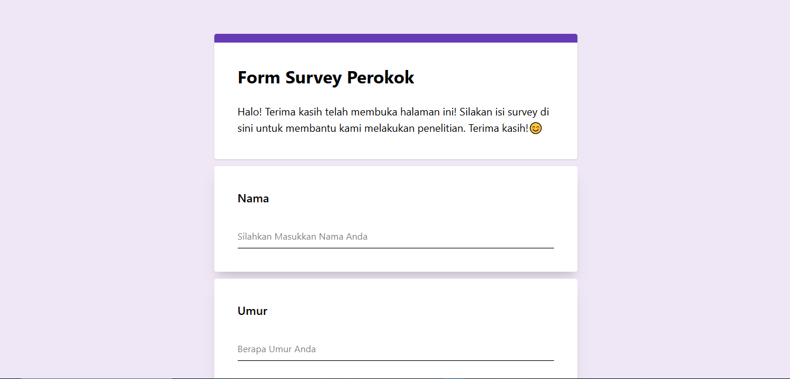

# React Redux Form Survey

This project is a simple form survey built with react hook form and use React Redux to manage form data and dynamically render a table of responses.

## Preview

##### Form Page


##### Result Survey Table Page


## How to Run This Project

### I. Manually
1. Clone the repository:
   ```bash
   git clone https://github.com/VsalCode/fgo24-react-redux.git
   ```

2. Navigate to the project folder:
   ```bash
   cd fgo24-react-redux
   ```

3. Install dependencies:
   ```bash
   npm install
   ```

4. Run the development server:
   ```bash
   npm run dev
   ```

5. Open your browser and visit `http://localhost:5173` (or the port shown in the terminal).

### II. With Docker
1. Clone the repository:
   ```bash
   git clone https://github.com/VsalCode/fgo24-react-redux.git
   ```

2. Navigate to the project folder:
   ```bash
   cd fgo24-react-redux
   ```

3. Build the Docker image:
   ```bash
   docker build . -t reduxform:latest
   ```

4. Run the Docker container:
   ```bash
   docker run -p 8080:80 -d reduxform:latest
   ```

5. Visit the app at `http://localhost:8080`.

## Dependencies used
- Vite
- Tailwind CSS
- React Hook Form
- React Router DOM
- Redux

## How to Contribute
Pull requests are welcome! For major changes, please open an issue first to discuss your proposed changes. Ensure tests are updated as needed.

## License
[MIT](https://opensource.org/license/mit)
